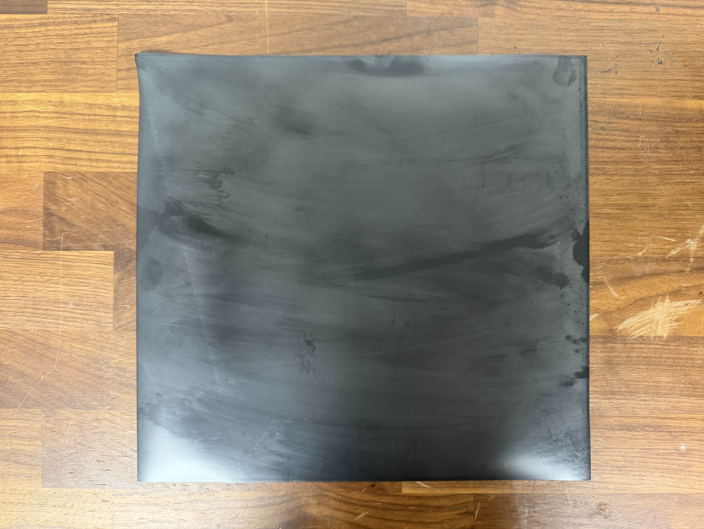

# Clean. Your. Plate.

90% of the time, warping and lack of adhesion are caused by dirty build plates.

Your build plate depends on interesting interactions of heat and chemistry to bond your filament while printing, but let it go when cooled. None of that works if your build plate is covered in contaminants.

The most common contaminants are oils from your hands, contamination from other prints, and other contaminants from the environment. Open printers like the A1 are especially prone to environmental contamination.

Before you do anything else, deep-clean your plate.

1. Remove the plate from the printer.
2. Clean the plate according to the plate's [cleaning instructions](https://darkmoon3d.com/pages/plate-comparison) (generally Dawn/Fairy dish soap, hot water, and a clean nylon scrubber or sponge).
3. Let the plate dry completely, or dry it with a lint-free paper towel.
4. Do not touch the plate with your bare hands.
5. Reinstall the plate on the printer.

Try your print again. If it's still not good, try the next step.

> [!CAUTION]
> Do not use IPA or soap on the ICE plate!
>
> It may not immediately damage the plate, but will cause it to degrade quicker than normal

## No, wiping with IPA isn't cleaning

Wiping with IPA is more like sweeping; it can remove some surface contaminants, but it's not _cleaning_.

This is an extreme example of what happens when you wipe with IPA instead of cleaning. This is the _bottom surface of a print_ on a plate that was wiped with IPA instead of being properly cleaned.

