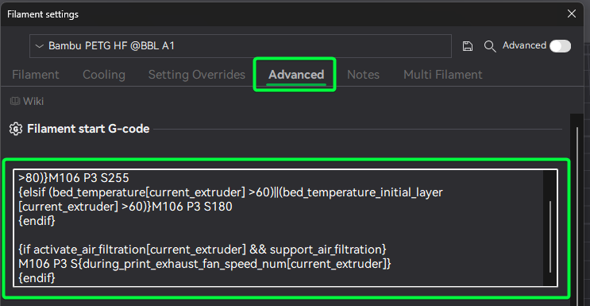

# Z-Offset Tuning

## Plate Settings

If you find that your first layers are just a little far from the plate, Try using the "Textured PEI" setting if you were using the "Smooth PEI" plate setting. The "Textured PEI" plate setting puts the nozzle a bit closer to the plate, and is often enough to fix a z-offset not close enough issue.

## Manual Z-Offset

If the plate settings don't work, you can manually adjust the z-offset.

We've observed and experimentally confirmed that different filaments require different z-offsets sometimes. We know, it's weird.

Making the change in the filament profile lets you tune the z-offset for each filament instead of changing it for all filaments and plates.



Edit the Filament Start G-Code to add a Z-offset adjustment. This gcode will add a small amount of lift to the nozzle. You'll want to tune this in very small steps.

Add this after the `; filament start gcode` comment in the start G-code text box.

```gcode
;===== Z-offset adjustment for Smooth PEI Plate =====
{if curr_bed_type=="High Temp Plate"}
G29.1 Z{0.01} ; Lift nozzle slightly
{endif}
```

The important part is the `G29.1 Z{0.01}` line. Positive values move the nozzle away from the plate, negative values move it closer.

When you save this, you'll have to give the profile a new name; we suggest `Filament name - G10 Z-Offset` or similar.
